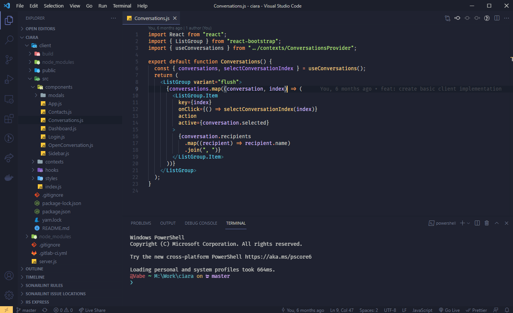

# Bentheme

My personalised version of the famous Ayu theme

# Installation

1. Open the **Extensions** sidebar in VS Code (or `View → Extensions`)
2. Search for `bentheme`, choose "bentheme" by **Benvalent**
3. Click **Install**
4. Press `Ctr + K, Ctrl + T` and select `bentheme` from the panel

# Additional settings

- **font**: on the images I currently use `Fira Code Retina`
